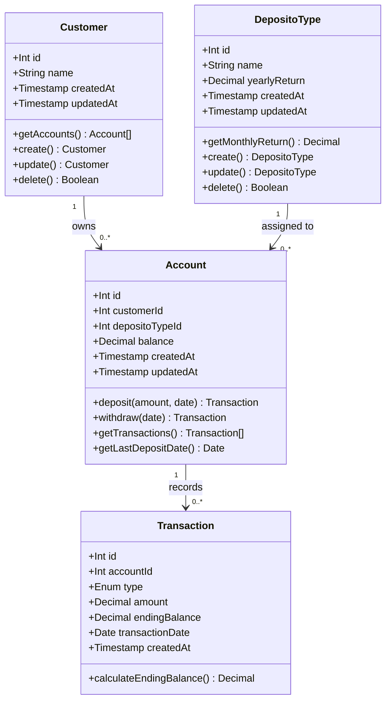

# Class Diagram — Bank Saving System

## Method notes

| Class | Method | Notes |
|---|---|---|
| `DepositoType` | `getMonthlyReturn()` | Returns `yearlyReturn / 12` |
| `Account` | `deposit(amount, date)` | Increases balance, inserts transaction row |
| `Account` | `withdraw(date)` | Calls `calculateEndingBalance`, sets balance to 0, inserts transaction row |
| `Account` | `getLastDepositDate()` | Fetches the most recent deposit `transaction_date` for interest calculation |
| `Transaction` | `calculateEndingBalance()` | `balance + (balance × months × monthlyReturn)` |
