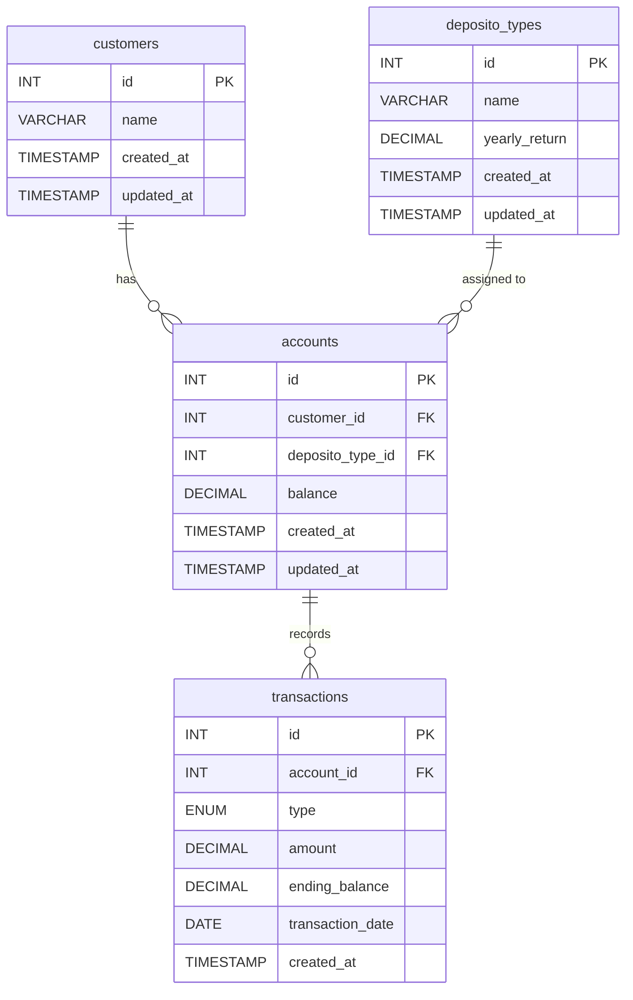

```mermaid
erDiagram
  customers ||--o{ accounts : "has"
  deposito_types ||--o{ accounts : "assigned to"
  accounts ||--o{ transactions : "records"

  customers {
    INT id PK
    VARCHAR name
    TIMESTAMP created_at
    TIMESTAMP updated_at
  }

  deposito_types {
    INT id PK
    VARCHAR name
    DECIMAL yearly_return
    TIMESTAMP created_at
    TIMESTAMP updated_at
  }

  accounts {
    INT id PK
    INT customer_id FK
    INT deposito_type_id FK
    DECIMAL balance
    TIMESTAMP created_at
    TIMESTAMP updated_at
  }

  transactions {
    INT id PK
    INT account_id FK
    ENUM type
    DECIMAL amount
    DECIMAL ending_balance
    DATE transaction_date
    TIMESTAMP created_at
  }
```