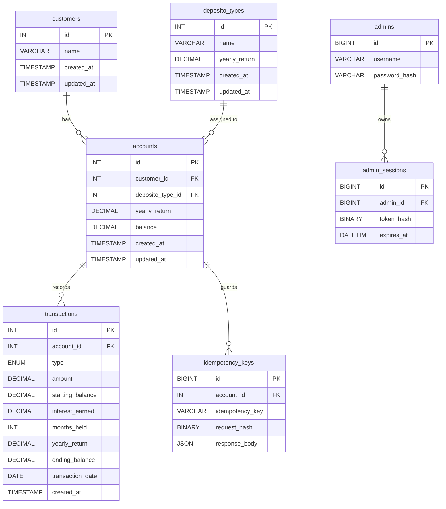

```mermaid
erDiagram
  customers ||--o{ accounts : "has"
  deposito_types ||--o{ accounts : "assigned to"
  accounts ||--o{ transactions : "records"
  admins ||--o{ admin_sessions : "owns"
  accounts ||--o{ idempotency_keys : "guards"

  customers {
    INT id PK
    VARCHAR name
    TIMESTAMP created_at
    TIMESTAMP updated_at
  }

  deposito_types {
    INT id PK
    VARCHAR name
    DECIMAL yearly_return
    TIMESTAMP created_at
    TIMESTAMP updated_at
  }

  accounts {
    INT id PK
    INT customer_id FK
    INT deposito_type_id FK
    DECIMAL yearly_return
    DECIMAL balance
    TIMESTAMP created_at
    TIMESTAMP updated_at
  }

  transactions {
    INT id PK
    INT account_id FK
    ENUM type
    DECIMAL amount
    DECIMAL starting_balance
    DECIMAL interest_earned
    INT months_held
    DECIMAL yearly_return
    DECIMAL ending_balance
    DATE transaction_date
    TIMESTAMP created_at
  }

  admins {
    BIGINT id PK
    VARCHAR username
    VARCHAR password_hash
  }

  admin_sessions {
    BIGINT id PK
    BIGINT admin_id FK
    BINARY token_hash
    DATETIME expires_at
  }

  idempotency_keys {
    BIGINT id PK
    INT account_id FK
    VARCHAR idempotency_key
    BINARY request_hash
    JSON response_body
  }
```
