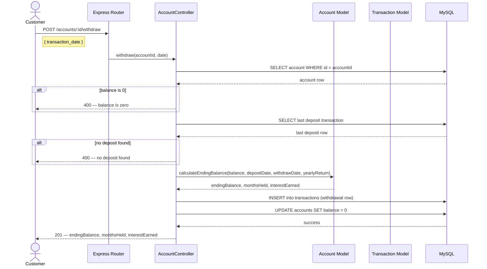

# Sequence Diagram — Withdrawal Flow



## Step-by-step explanation

| Step | Description |
|---|---|
| 1 | Customer sends `POST /accounts/:id/withdraw` with a `transaction_date` |
| 2 | Router delegates to `AccountController.withdraw()` |
| 3 | Controller fetches the account — returns 404 if not found |
| 4 | Guard: if `balance == 0`, return 400 immediately |
| 5 | Fetch the most recent deposit transaction to get the start date |
| 6 | Guard: if no deposit exists, return 400 (nothing to calculate from) |
| 7 | Calculate `endingBalance = balance + (balance × months × monthlyReturn)` |
| 8 | Insert a withdrawal row into `transactions` with `ending_balance` populated |
| 9 | Update `accounts.balance = 0` |
| 10 | Return 201 with the full calculation breakdown to the customer |

## Interest calculation formula

```
monthly_return  = yearly_return / 12
months          = DATEDIFF in months (deposit_date → withdrawal_date)
interest        = balance × months × monthly_return
ending_balance  = balance + interest
```
