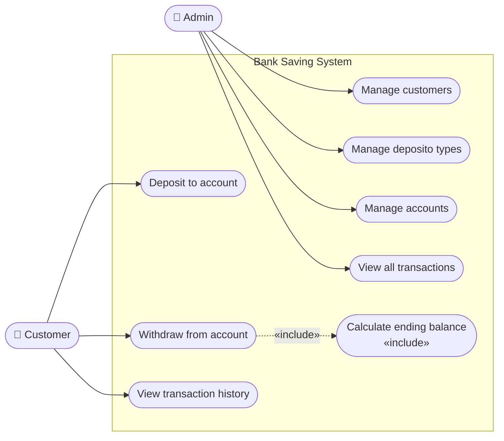

# Use Case Diagram — Bank Saving System



## Actor descriptions

| Actor | Role |
|---|---|
| Admin | Manages the system — creates/edits/deletes customers, deposito types, and accounts |
| Customer | Interacts with their own account — deposits, withdraws, views history |

## Use case descriptions

| Use Case | Actor | Description |
|---|---|---|
| Manage customers | Admin | Create, edit, delete customer records |
| Manage deposito types | Admin | Create, edit, delete deposito type catalogue |
| Manage accounts | Admin | Open, edit, delete accounts; assign customer + deposito type |
| View all transactions | Admin | See full transaction history across all accounts |
| Deposit to account | Customer | Add balance to an account with a date |
| Withdraw from account | Customer | Withdraw full balance; triggers interest calculation |
| View transaction history | Customer | View deposit/withdrawal history for an account |
| Calculate ending balance | System | **«include»** — automatically triggered on withdrawal; not a user action |
```
